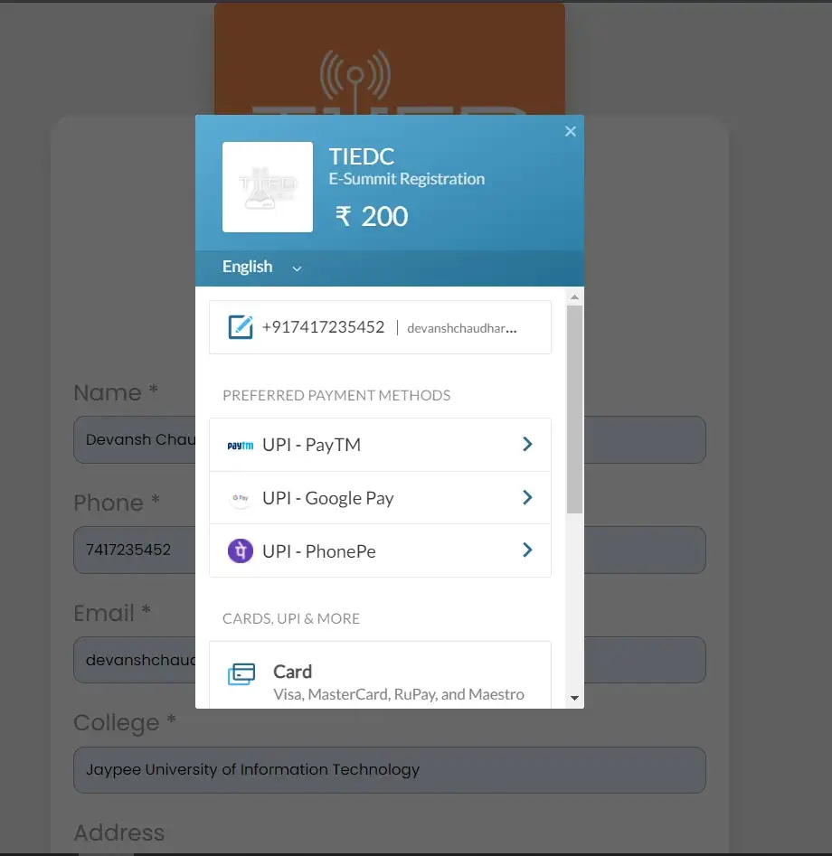
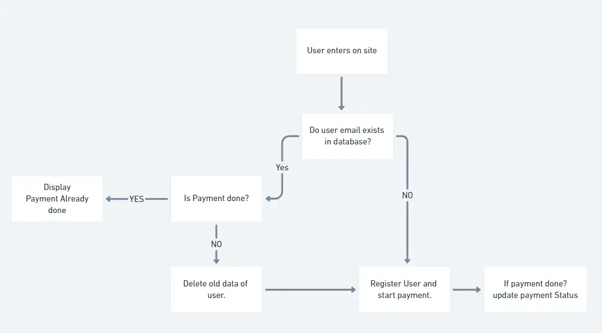
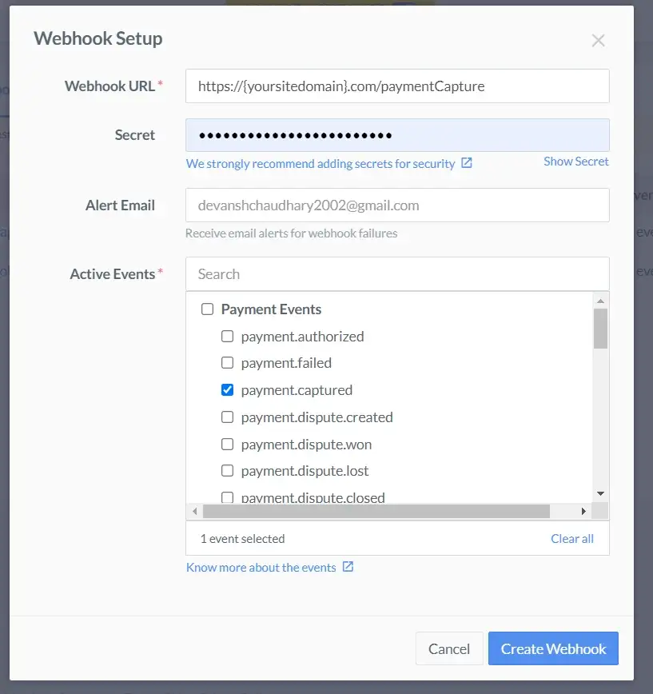
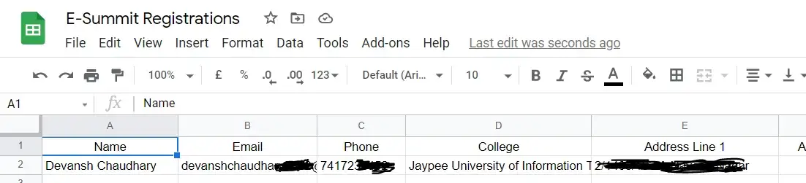

I recently had to create a web app for my university's E-cell annual entrepreneurship summit where users can book tickets and make payments for the summit.

Since I have never worked with a payment gateway, I searched for payment gateways and found Razorpay. It has well-written developer’s documentation and is very easy to work with, and has a snappy UI and for the frontend.

The user registration details which the website collects were to be used by a group of non-technical people, so to make their work easier, I also created a google sheet where the users who successfully registered and made the payment are added using Google APIs.



Before starting, you will need a Razorpay account; you can sign-up using my affiliate link and get the Razorpay ID and Razorpay secret to accept payments.

I will be creating a NodeJS app with MongoDB to accept payments using Razorpay and store user registration data and then google APIs for adding the data to google sheets.

I have also created a flowchart so you can easily understand the behind the scene logic.


Steps to create a registration portal with Razorpay.

1. Initialize a project and install the following dependencies.
```
npm init
npm install body-parser crypto dotenv express googleapis mongoose razorpay
```


2. Create .env file and add the Razorpay credentials and MongoDB URL. Create a google sheet to get the spreadsheetid.
```
razorpay_key_id = ""
razorpay_key_secret = ""
MONGODB_URL = ""
spreadsheetId = ""
```
For example https://docs.google.com/spreadsheets/d/1reuufhreoifuYHUBYU32B/edit#gid=0 the spreadsheet id is 1reuufhreoifuYHUBYU32B.


3. Create a webhook on Razorpay dashboard with webhook URL as https://yoursitedomain.com/paymentCapture , secret same as your Razorpay id secret and payment.captured as an active event. So whenever a user completes the payment Razorpay will send you a request on the server with payment details.


4. Create the index.js file it will contain the code to start the servers.
```
const express = require('express')
const bodyParser = require('body-parser');
const path = require('path');
const app = express();

require('dotenv').config();
require('./util/database');

// Extracts Body in HTTP requests
app.use(bodyParser.urlencoded({ extended: true}));
app.use(bodyParser.json());

// Serving static files from public folder
app.use(express.static(path.join(__dirname, 'public')));

// Payment Route
const paymentRoute = require('./routes/paymentRoute')
app.use('/', paymentRoute);

// Starting the server
app.listen(process.env.PORT || 80);
console.log('Server is running.')
```

5. Create util/database.js this will help to connect to the MongoDB database.
```
require('dotenv').config();
const mongoose = require('mongoose');

const connectionOptions = { 
    useNewUrlParser: true, 
    useUnifiedTopology: true 
};

mongoose.connect(process.env.MONGODB_URL, connectionOptions);
mongoose.Promise = global.Promise;

module.exports = {
    User: require('../models/user')
};
```

6. Create util/googleSheet.js This is optional if you want the data to be displayed in the google spreadsheet.
```
const { google } = require("googleapis");

async function insertData(userdata){
    const auth = new google.auth.GoogleAuth({
        keyFile: "google-credentials.json",
        scopes: "https://www.googleapis.com/auth/spreadsheets",
    });
    const client = await auth.getClient();

    // Instance of Google Sheets API
    const googleSheets = google.sheets({ version: "v4", auth: client });
    const spreadsheetId = process.env.spreadsheetId;
    const metaData = await googleSheets.spreadsheets.get({ auth, spreadsheetId,});
    const getRows = await googleSheets.spreadsheets.values.get({ auth, spreadsheetId, range: "Sheet1!A:A", });

    // Write row(s) to spreadsheet
    await googleSheets.spreadsheets.values.append({
        auth, spreadsheetId, range: "Sheet1!A:B", valueInputOption: "USER_ENTERED",
        resource: {
            values: [userdata],
        },
    });
}

module.exports = {
    insertData
};
```

7. Create routes/paymentRoute.js These files handle the incoming requests on the server. The orders route creates an order with Razorpay and sends the order id with other details to the client to make payment.
```
const express = require('express')
const router = express.Router();
require('dotenv').config();
const paymentController = require('../controllers/paymentController')

router.post('/orders', orders);
router.post('/paymentCapture', paymentCapture);

async function orders(req, res, next){
    paymentController.register(req,res,next);
}

async function paymentCapture(req, res, next){
    paymentController.verifyPayment(req,res,next);
}

module.exports = router;
```

8. Create controllers/paymentController.js Here comes all the logic for the user registration and payment verification we are using crypto to generate and verify the signature for the payment verification. You can remove the google sheets code if you don’t want your data to be added to sheets.
```
const User = require('../models/user');
const googleSheets = require('../util/googleSheet');
const Razorpay = require('razorpay');
const crypto = require('crypto');
require('dotenv').config();

async function register(req, res, next) {

    const { name, phone, email, college, address1, address2, city, pincode, state} = req.body;
    var user_detail = await User.findOne({ email });

    // If user exists in database
    if (user_detail) {
        if(user_detail.paymentStatus){
             // Payment already done 
            res.status(200).json({
                StatusCode: "201",
                message: "Payment Already Done."
            }).send();
            return ;
        }else{ 
            // Payment not done
            await User.deleteOne({ "email": req.body.email });
        }
    }

    // Razorpay
    const razorpay = new Razorpay({
        key_id: process.env.razorpay_key_id,
        key_secret: process.env.razorpay_key_secret
    })
    
    var options = {
        amount: 20000, // RS 200
        currency: "INR",
        receipt: "order_rcptid_11",
        notes: { 
            name, phone, email
        }
    };
        
    try {
        // Order Details Send to RazorPay
        const response = await razorpay.orders.create(options)

        // Saving User Details and razorpay order id in our database
        const user = new User({
            name, phone, email, college, address1, address2, city, pincode, state,
            "order_id": response.id
        });
        await user.save();

        //Sending payment id and other details back to user
        res.json({
            StatusCode: "1",
            order_id: response.id,
            currency: response.currency,
            amount: response.amount,
            name, phone, email,
            "razorpay_key_id": process.env.razorpay_key_id
          })
        } catch (error) {
            console.log(error);
            res.status(200).json({
                StatusCode: "201",
                message: "Unable to create order."
            }).send();
        }
}

async function verifyPayment(req, res, next){
    var msg = req.body.razorpay_order_id + "|" + req.body.razorpay_payment_id;
    var generated_signature = await crypto.createHmac('SHA256', process.env.razorpay_key_secret).update(msg).digest('hex');

    // Verify Signature
    if (generated_signature == req.body.razorpay_signature) {
        // Updating payment status
        const currentDate = Date.now()
        await User.updateOne({ order_id: req.body.razorpay_order_id },{paymentStatus: true, paymentDate: currentDate });

        // Inserts data to google sheets
        var user_data = await User.findOne({ order_id: req.body.razorpay_order_id });
        await googleSheets.insertData([user_data.name, user_data.email, user_data.phone, user_data.college, user_data.address.address1, user_data.address.address2, user_data.address.city, user_data.address.state, user_data.address.pincode, user_data.order_id, user_data.paymentDate ]);

        res.redirect('/thankyou.html');
    }
    else {
        res.send("Payment Failed.");
    }
}

module.exports ={
    register,
    verifyPayment
}
```

9. Create models/user.js It contains the schema for the database.
```
const mongoose = require('mongoose');
const Schema = mongoose.Schema;

const userSchema = new Schema({
    email: { type: String, unique: true, required: true },
    name: { type: String,  required: true},
    college: {type: String, required: true},
    phone: {type: String, required: true},
    address: {
        address1:{type: String, required: true},
        address2: {type: String},
        city: {type: String, required: true},
        pincode:{type: String, required: true},
        state: {type: String, required: true},
    },
    order_id: {type: String, required: true},
    paymentStatus:{type: Boolean, default: false},
    paymentDate: { type: Date },
    createdDate: { type: Date, default: Date.now }
});

userSchema.set('toJSON', {
    virtuals: true,
    versionKey: false,
    transform: function (doc, ret) {
        delete ret._id;
    }
});

module.exports = mongoose.model('User', userSchema);
```

10. You can get a google credential for google sheet API from google console by following the steps given in the video below. After getting the google credential file save it in the project folder as “google credential.json”. Also, add the client email which you created as an editor to the google sheet.


The google credential file should be added to the root directory of the project.



11. On the frontend side we need to include:
```
<script src="https://checkout.razorpay.com/v1/checkout.js"></script>
<script src="https://cdn.jsdelivr.net/npm/axios/dist/axios.min.js"></script>
```

```
base_url = "http://localhost";

function register(){
    var data = JSON.stringify({
        "name": document.getElementById("name").value,
        "phone": document.getElementById("phone").value,
        "email": document.getElementById("email").value,
        "college": document.getElementById("college").value,
        "address":{
            "address1": document.getElementById("address1").value,
            "address2": document.getElementById("address2").value,
            "city": document.getElementById("city").value,
            "pincode": document.getElementById("pincode").value,
            "state": document.getElementById("state").value
        }
    });

    var config = {
        method: 'post',
        url: base_url + '/orders',
        headers: { 
            'Content-Type': 'application/json'
        },
        data : data
    };

    axios(config)
        .then(function (response) {
            console.log(JSON.stringify(response.data));
            if(response.data.StatusCode == "201"){
                alert(response.data.message);
                return;
            }
            var options = {
                "key": response.data.razorpay_key_id,
                "amount": response.data.amount,
                "currency": response.data.currency,
                "name": "E-Cell",
                "description": "E-Summit Registration",
                "image": base_url + '/logo-white.png',
                "order_id": response.data.order_id, 
                "callback_url": base_url + '/paymentCapture',
                "prefill": {
                    "name": response.data.name,
                    "email": response.data.email,
                    "contact": "+91" + response.data.phone
                },
                "theme": {
                    "color": "#3399cc"
                }
            };
            console.log(options)
            var rzp1 = new Razorpay(options);
            rzp1.open();
            e.preventDefault();
        })
        .catch(function (error) {
            console.log(error);
        });
}
```

You will need to change the base_url. The function register() sends the form details to the server, and the server then returns the order id, amount, razorpay_id with other information. Then we prefill these details (we prefill the details, so the user does not have to re-enter them on the Razorpay) and initialize the Razorpay. Once the payment is made, Razorpay sends the payment ID and other details to /capturePayment.

Well, you have learned how to create a registration site with Razorpay integration in under 20 minutes. Also, we have known to insert data in google sheets using nodeJS, enabling us to work with data easily.

You can find the source in this [Github Repository](https://github.com/devansh016/registration-portal).
